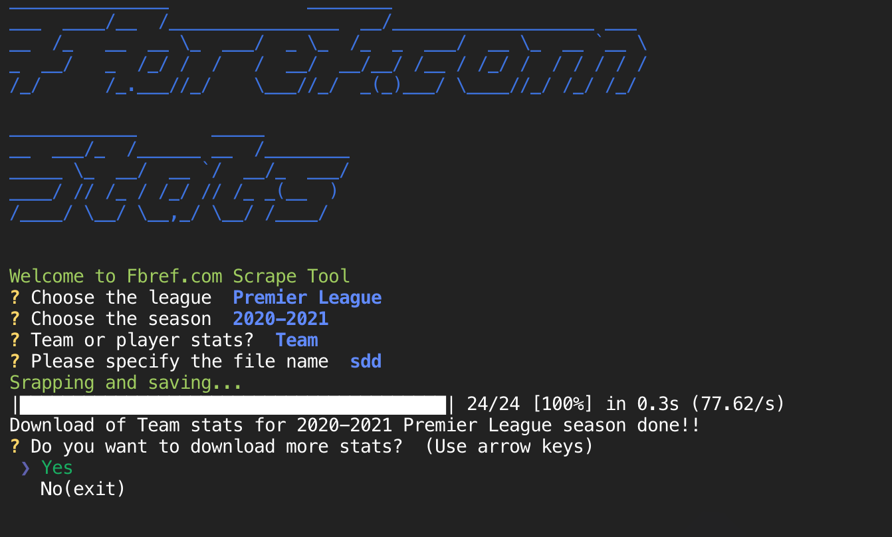

## Scrape Cli Tool for Fbref


This tool will scrape data from Fbref.com website and download *.xlsx* files into your machine.

### How to run this tool (recommended steps)?

1. Download or `git clone` the code to your local machine

2. Install pipenv:

```pip install pipenv```

1. Change to the directory containing the code and install all dependencies:

```pipenv install```

3. Activate the virtual environment

```pipenv shell```

4. Execute the code

```python cli.py```

5. Follow the steps to scrape stats from your desired league/season




The resulting .xlsx files will be stored in the `data` folder